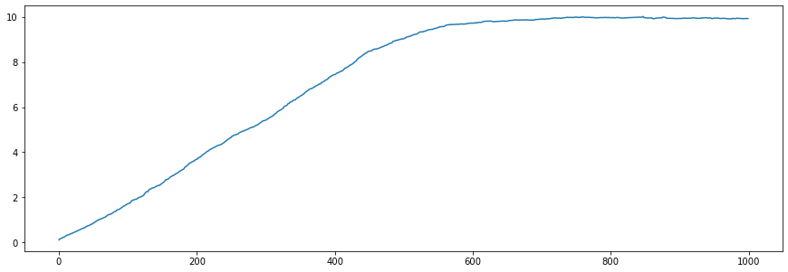

# DLTerm GA API v0.2

by Chun-yien Chang

## API base url

- `http://ccy.nclab.tw:8001/dl`

## Initiation

- Format: `{base url}/:token`

- Method: `POST`

- Data

```json
{
    "latent_size": 128, // Latent code size (required)
    "population_size": 200, // Optional
    "mutation_rate": 0.95, // Optional
    "crossover_rate": 0.95, // Optional
    "elitism_count": 50 // Optional
}
```

- Return

```json
{
  "generation": 0,
  "session_id": ":token",
  "message": "ok",
  "population": [
    {
      "latent_code": [
        -0.3111291297453356,
        0.085502046806012,
        //...
      ],
      "id": "1ef39b1a-8a3d-4093-9bce-d2614935e423"
    },
    {
      "latent_code": [
        2.2158262107729265,
        -0.5061411779978846,
        //...
      ],
      "id": "ad852999-8f3d-47fb-a6a9-4fdb43bf1810"
    },
    // ...
  ]
}
```

## Evolution

- Format: `{base url}/:token` (The token must have been initiated first).

- Method: `POST`

- Data

```json
{
    "eval": {
      "2eb12dce-d955-4923-b3c5-7e9c69be2387": 10.758912869117676, 
      "0186f193-44b7-43e2-a64c-c22c92306395": 9.618171244360152,
      "1b6c98a2-b18d-47fb-8d54-e2889e1c6dff": 10.410184337983251,
      "bfc9e8e5-4c40-4fc0-a347-23bf01d5985c": 10.350927795010277, 
      "f5ccff57-4fc3-4ab5-8a34-de8c822dc4a2": 10.272282897686525
    } // Evaluation of each individual, with id as key (required)
}
```

- Return

```json
{
  "generation": 1,
  "session_id": ":token",
  "message": "ok",
  "population": [
    {
      "latent_code": [
        -0.3111291297453356,
        0.085502046806012,
        //...
      ],
      "id": "1ef39b1a-8a3d-4093-9bce-d2614935e423"
    },
    {
      "latent_code": [
        2.2158262107729265,
        -0.5061411779978846,
        //...
      ],
      "id": "ad852999-8f3d-47fb-a6a9-4fdb43bf1810"
    },
    // ...
  ]
}
```
## Sample code in Python
```python
import requests, random, json
import numpy as np
import matplotlib.pyplot as plt

def evaluation(latent_code): # To be implemented
    return np.abs(np.average(latent_code)-10)

token = 'MyToken'
url = "http://ccy.nclab.tw:8001/dl/%s" % token
headers = {'Content-type': 'application/json', 'Accept': 'text/plain'}
elitism_count = 20

evals, plot, gen = {}, [], []
for i in range(1000):
    #initialization
    if len(evals) == 0:
        data = {"latent_size": 128, "population_size": 100, "elitism_count": elitism_count}
    #evolution
    else:
        data = {"eval": evals}
    
    req = requests.post(url, data=json.dumps(data), headers=headers)
    if req.status_code == 200:
        evals, eval_buf = {}, []
        population = req.json()['population']
        for ind in population:
            id = ind['id']
            latent_code = ind['latent_code']
            ind['eval'] = evaluation(latent_code)
            evals[id] = ind['eval']
        eval_buf = [np.average(item['latent_code']) for item in sorted(population, key=lambda item: item['eval'])[0:elitism_count]]
        gen.append(req.json()['generation'])
        plot.append(np.average(eval_buf))
    else:
        print(req.status_code)
        break

plt.figure(figsize=(15,5))
plt.plot(gen, plot)
```

